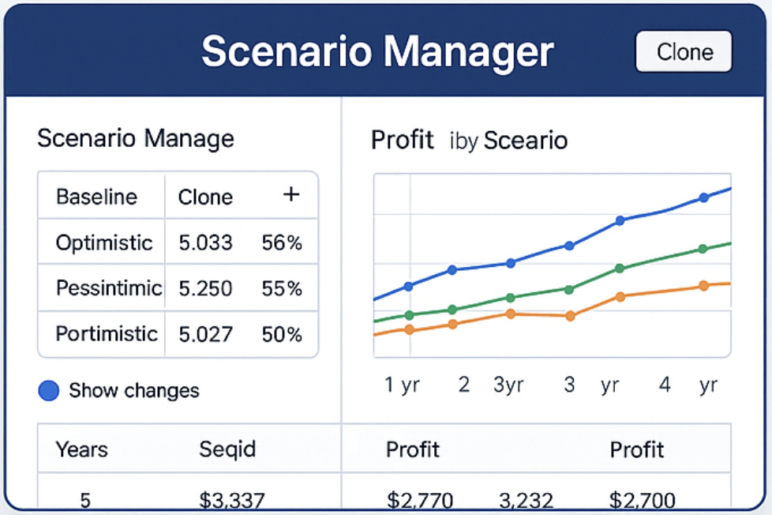
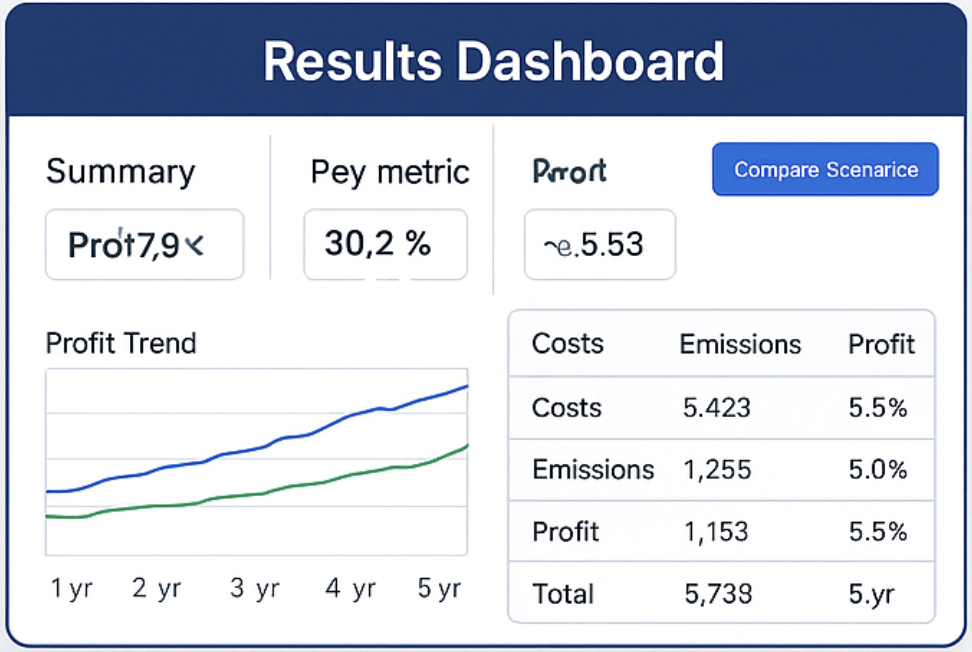
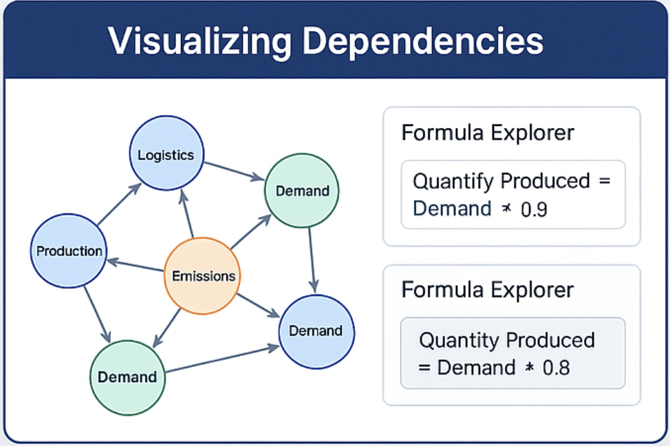

# Task 4: Product Thinking & Usability

## Key Features & Interactions

### 1. Model Setup Wizard
- **Step-by-step guide** for creating a model:
  1. Define **Blocks** (business areas like Production, Logistics)
  2. Add **Attributes** (inputs or calculated)
  3. Define **Formulas** and **Relationships**
- **Pre-built templates:** Common models for quick setup
- **Inline tips and examples:** Help users with formulas

### 2. Scenario Manager
- Create and manage multiple scenarios
- **Clone & modify scenarios** easily
- **Compare scenarios side-by-side** in tables or charts
- **Track changes across versions**

### 3. Results Dashboard
- Summary of **key metrics (KPIs)** like costs, emissions, profit
- Visualizations:
  - Line/Bar charts for trends
  - Tables for detailed outputs
  - Scenario comparison views
  

### 4. Visualizing Dependencies
- **Interactive Graph View:** 
  - Visual map of Blocks, Attributes, and their relationships
  - Highlight **feedback loops** (cycles)
  - Clickable nodes to see formulas or definitions
- **Formula Explorer:** Navigate formulas visually

### 5. Sensitivity Analysis Tools
- **Sliders:** Change input values dynamically
- **Impact Heatmaps:** See which attributes impact outcomes the most
- **Spider/Radar charts:** Visualize sensitivity across multiple variables

## Bonus Features
- **What-If Playground:** Change inputs and immediately see output changes
- **AI Suggestions:** Recommend optimizations or flag sensitive attributes
- **Explanations in Plain Language:** Easy-to-read descriptions of calculations